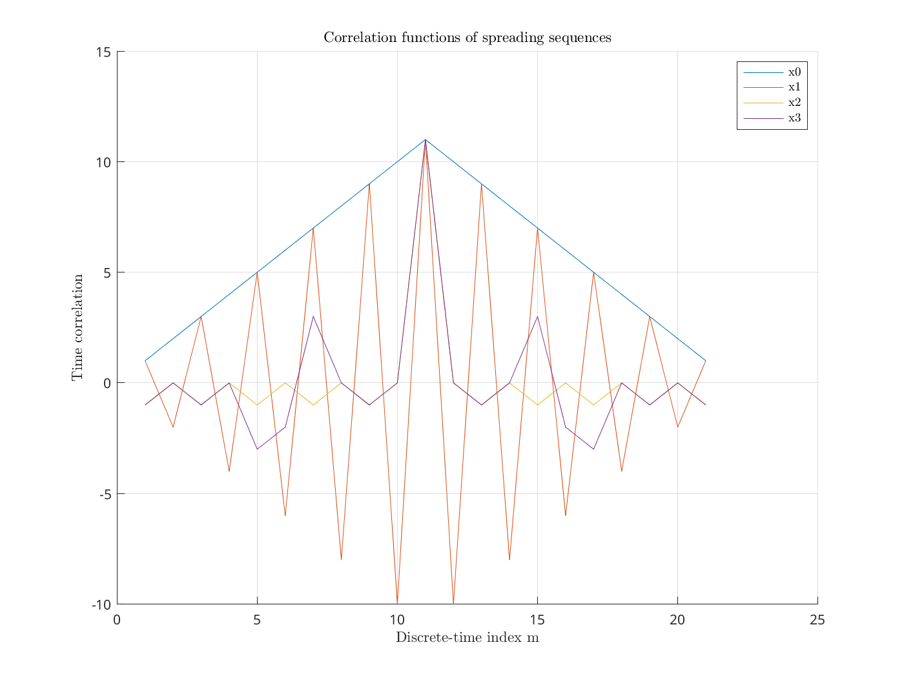
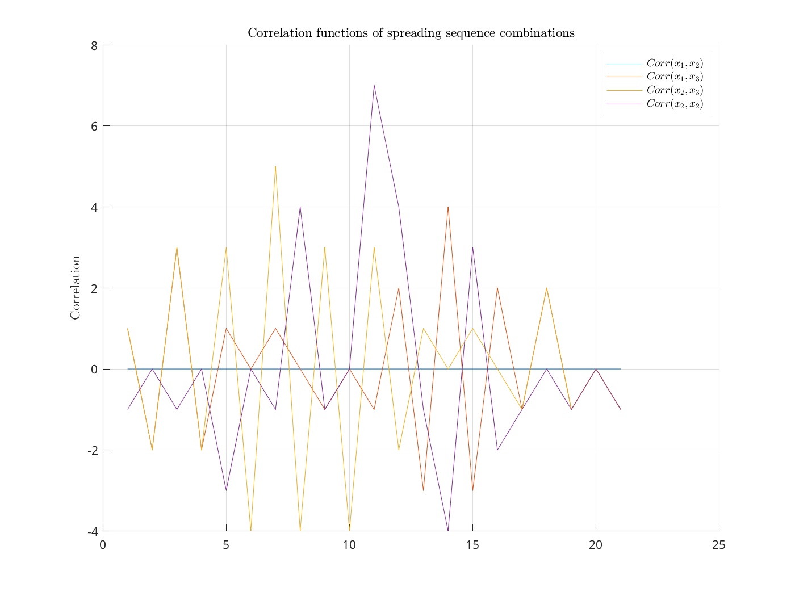
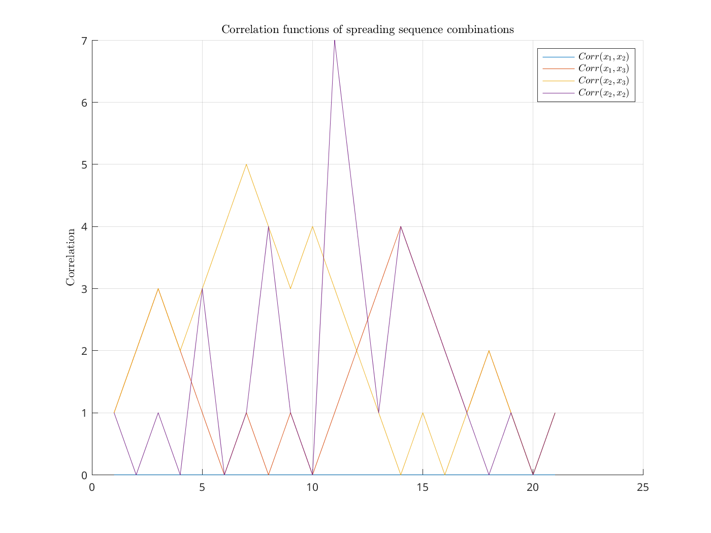
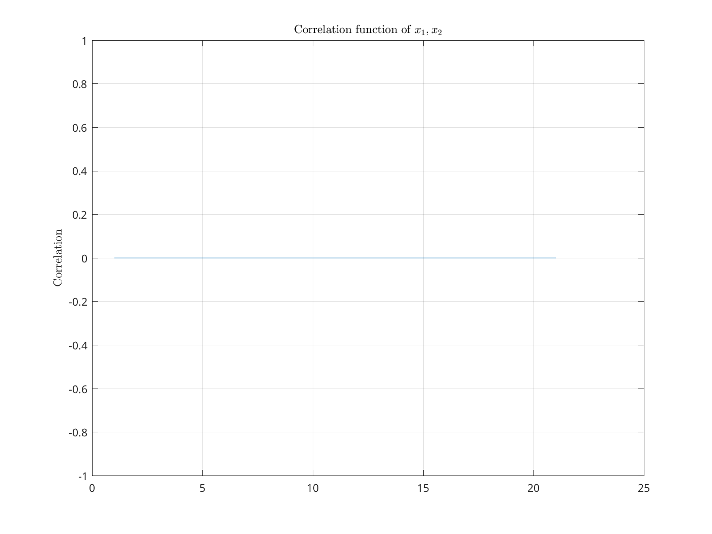
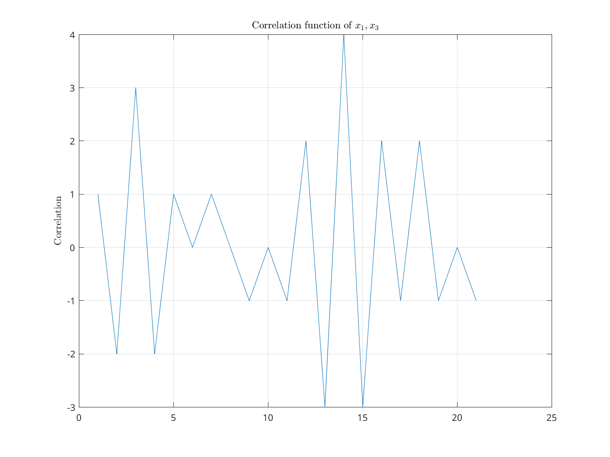
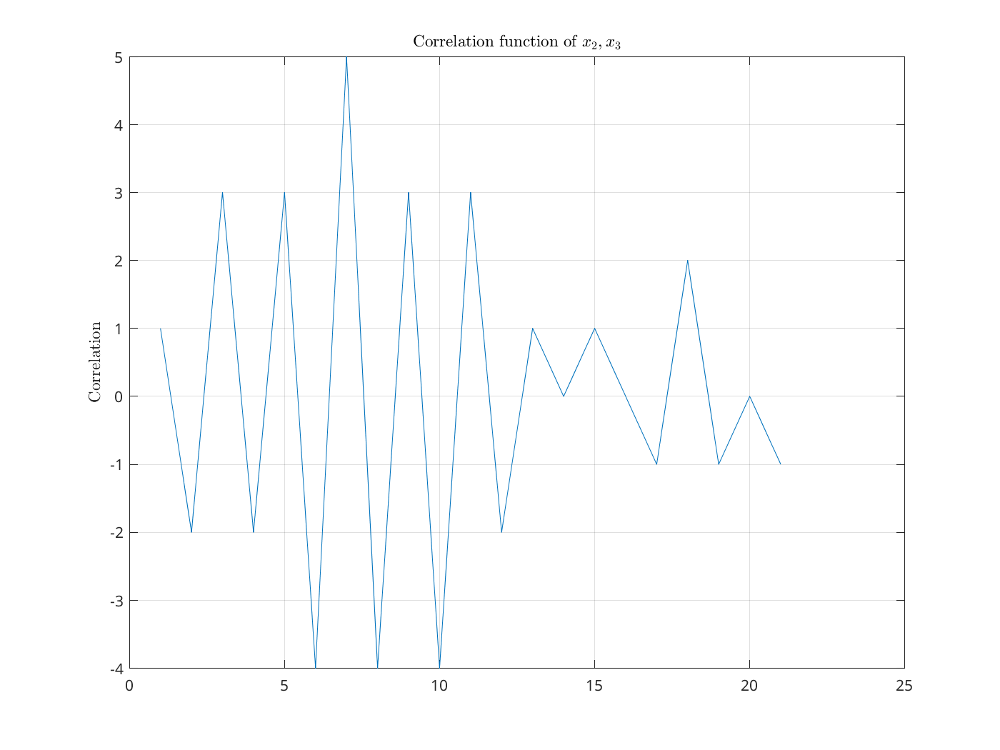
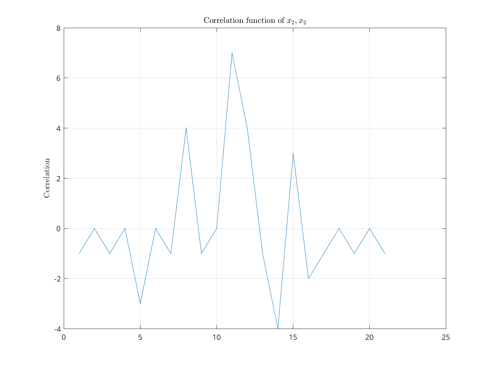

Digital Communications

# Quiz for Lab exercise 2 (A): Spread Spectrum

Academic year 2024/2025

| Student names          | Grade |
| ---------------------- | ----- |
| Alonso Herreros Copete |       |

---

Fill in the data obtained in your simulations and give a reasoned answer to the
following questions

## 1. Transmission @ Chip time (1 user)

What is the energy of channel $d[m]$?

> As calculated using $\sum_{k} |d[k]|^2$, the energy is $5.263$.

Fill the following table:

|       | Energy $p[n]$ | $P_e (σ_{z_c}²=0)$ | $P_e (σ_{z_c}²=1)$ | BER ($σ_{z_c}²=0$) | BER ($σ_{z_c}²=1$) |
| ----- | ------------- | ------------------ | ------------------ | ------------------ | ------------------ |
| $x_0$ | 4319.1        | 0.5327             | 0.5373             | 0.3093             | 0.3112             |
| $x_1$ | 37.6          | 0.0000             | 0.0590             | 0.0000             | 0.0295             |
| $x_2$ | 67.9          | 0.0000             | 0.0144             | 0.0000             | 0.0072             |
| $x_3$ | 74.6          | 0.0000             | 0.0154             | 0.0000             | 0.0077             |

In view of the simulations, explain the results obtained and relate them to the
correlation function of each sequence.

> The following is the plot of the correlation function of all sequences:
>
> 
>
> While it may not be very easy to visualize, we can actually see that the
> correlation function of $x_0$ is the one with the highest peak, which is why
> it has the highest error probability. The correlation function of $x_1$
> oscillates with very high amplitude, which is why it has lower error
> probability, but it is still high. The correlation functions of $x_2$ and
> $x_3$ have very low amplitudes, and their error probabilities are the lowest.

In which order would you use the sequences given the previous results?

> The order would be from lowest to highest error probability:
>
> $$
> x_2, x_3, x_1, x_0
> $$

## 2. CDMA: transmission of 2 users

Fill the following tables:

Ideal channel

|                           | Dot   product | $P_e (σ_{z_c}²=0)$   A$\big\vert$B | $P_e (σ_{z_c}²=1)$   A$\big\vert$B | BER $(σ_{z_c}²=0)$   A$\big\vert$B | BER $(σ_{z_c}²=1)$   A$\big\vert$B |
| ------------------------- | :---------------: | :------------------------------------: | :------------------------------------: | :------------------------------------: | :------------------------------------: |
| $x_A=x_1$   $x_b=x_2$ |       -1.0        |       0.0000 $\Bigg\vert$ 0.0000       |       0.0032 $\Bigg\vert$ 0.0033       |       0.0000 $\Bigg\vert$ 0.0000       |       0.0016 $\Bigg\vert$ 0.0017       |
| $x_A=x_1$   $x_b=x_3$ |        3.0        |       0.0000 $\Bigg\vert$ 0.0000       |       0.1063 $\Bigg\vert$ 0.1058       |       0.0000 $\Bigg\vert$ 0.0000       |       0.0532 $\Bigg\vert$ 0.0529       |
| $x_A=x_2$   $x_b=x_3$ |        7.0        |       0.3772 $\Bigg\vert$ 0.3725       |       0.4194 $\Bigg\vert$ 0.4146       |       0.1886 $\Bigg\vert$ 0.1862       |       0.2097 $\Bigg\vert$ 0.2073       |
| $x_A=x_2$   $x_b=x_2$ |       11.0        |       0.5629 $\Bigg\vert$ 0.5627       |       0.5632 $\Bigg\vert$ 0.5638       |       0.3439 $\Bigg\vert$ 0.3440       |       0.3442 $\Bigg\vert$ 0.3441       |

Channel proposed in (3)

|                           | Dot   product | $P_e (σ_{z_c}²=0)$   A$\big\vert$B | $P_e (σ_{z_c}²=1)$   A$\big\vert$B | BER $(σ_{z_c}²=0)$   A$\big\vert$B | BER $(σ_{z_c}²=1)$   A$\big\vert$B |
| ------------------------- | :---------------: | :------------------------------------: | :------------------------------------: | :------------------------------------: | :------------------------------------: |
| $x_A=x_1$   $x_b=x_2$ |       -1.0        |       0.0000 $\Bigg\vert$ 0.0000       |       0.0983 $\Bigg\vert$ 0.0263       |       0.0000 $\Bigg\vert$ 0.0000       |       0.0491 $\Bigg\vert$ 0.0132       |
| $x_A=x_1$   $x_b=x_3$ |        3.0        |       0.2498 $\Bigg\vert$ 0.0000       |       0.2916 $\Bigg\vert$ 0.0549       |       0.1249 $\Bigg\vert$ 0.0000       |       0.1461 $\Bigg\vert$ 0.0275       |
| $x_A=x_2$   $x_b=x_3$ |        7.0        |       0.4349 $\Bigg\vert$ 0.4307       |       0.4907 $\Bigg\vert$ 0.4714       |       0.2174 $\Bigg\vert$ 0.2154       |       0.2533 $\Bigg\vert$ 0.2394       |

In view of the simulations, explain the results obtained and relate them to the correlation function of each sequence.

> The following are the correlation functions of all sequences:
>
> 
>
> This graph is quite chaotic, but we can plot the absolute value to get a
> better idea of the correlation functions:
>
> 
>
> As we can see, the correlation function of $x_1$ and $x_2$ is exactly 0, which
> is why we can get zero error probabilities with the ideal channel. For the the
> case case of $x_1$ and $x_3$, the correlation function is no longer 0, but it
> stays close to 0, which is why we still get quite low error probabilities.
>
> However, for the rest of the cases, the correlation function has higher
> amplitude, and the error probabilities are higher. A simpler way to measure
> this phenomenon is the simple dot product: the higher the dot product between
> the spreading sequences, the higher the error probability.
>
> The following graphs display the correlation functions in separate plots:
>
> 
> 
> 
> 

What would be the order of pairs of sequences according to the results? Reason this order with the results obtained in the single user section.

> The order would be from lowest to highest error probability:
>
> $$
> x_1 \& x_2,\; x_1 \& x_3,\; x_2 \& x_3,\; x_2 \& x_2
> $$
